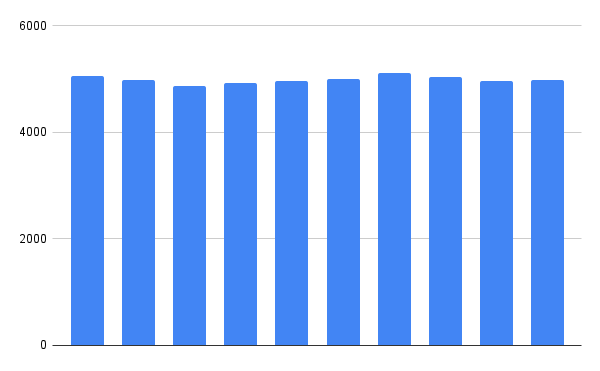
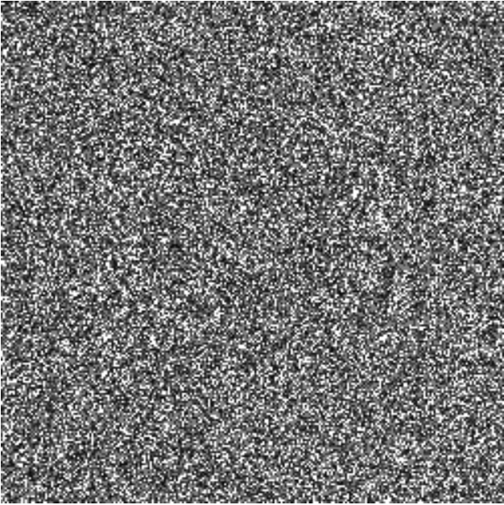

# Cuid2

Secure, collision-resistant ids optimized for horizontal scaling and performance. Next generation uuids.

Need unique ids in your app? Forget UUIDs and GUIDs which often collide in large apps. Use Cuid2, instead.

**Cuid2 is:**

* **Secure:** It's not feasible to guess the next id, existing valid ids, or learn anything about the referenced data from the id. Cuid2 uses multiple, independent entropy sources and hashes them with a security-audited, NIST-standard cryptographically secure hashing algorithm (Sha3).
* **Collision resistant:** It's extremely unlikely to generate the same id twice (by default, you'd need to generate roughly 4,000,000,000,000,000,000 ids ([`sqrt(36^(24-1) * 26) = 4.0268498e+18`](https://en.wikipedia.org/wiki/Birthday_problem#Square_approximation)) to reach 50% chance of collision.
* **Horizontally scalable:** Generate ids on multiple machines without coordination.
* **Offline-compatible:** Generate ids without a network connection.
* **URL and name-friendly:** No special characters.
* **Fast and convenient:** No async operations. Won't introduce user-noticeable delays. Less than 5k, gzipped.
* **But not *too fast*:** If you can hash too quickly you can launch parallel attacks to find duplicates or break entropy-hiding. For unique ids, the fastest runner loses the security race.


## Getting Started

```
npm install --save @paralleldrive/cuid2
```

Or

```
yarn add @paralleldrive/cuid2
```

```js
import { createId } from '@paralleldrive/cuid2';

const ids = [
  createId(), // 'tz4a98xxat96iws9zmbrgj3a'
  createId(), // 'pfh0haxfpzowht3oi213cqos'
  createId(), // 'nc6bzmkmd014706rfda898to'
];
```


## Trusted By

* [Greenruhm](https://discord.gg/greenruhm)
* [Submit my project](https://github.com/paralleldrive/cuid2/issues/new?title=Social+proof)

## Why?

Modern web applications have different requirements than applications written in the early days of GUID (globally unique identifiers) and UUIDs (universally unique identifiers). In particular, Cuid2 aims to provide stronger uniqueness guarantees than any existing GUID or UUID implementation and protect against leaking any information about the data being referenced, or the system that generated the id.

Cuid2 is the next generation of Cuid, which has been used in thousands of applications for over a decade with no confirmed collision reports. The changes in Cuid2 are significant and could potentially disrupt the many projects that rely on Cuid, so we decided to create a replacement library and id standard, instead. Cuid is now deprecated in favor of Cuid2.

Entropy is a measure of the total information in a system. In the context of unique ids, a higher entropy will lead to fewer collisions, and can also make it more difficult for an attacker to guess a valid id.

Cuid2 is made up of the following entropy sources:

* An initial letter to make the id a usable identifier in JavaScript and HTML/CSS
* The current system time
* Pseudorandom values
* A session counter
* A host fingerprint

The string is Base36 encoded, which means it contains only lowercase letters and the numbers: 0 - 9, with no special symbols.


### Horizontal scalability

Today's applications don't run on any single machine.

Applications might need to support online / offline capability, which means we need a way for clients on different hosts to generate ids that won't collide with ids generated by other hosts -- even if they're not connected to the network.

Most pseudo-random algorithms use time in ms as a random seed. Random IDs lack sufficient entropy when running in separate processes (such as cloned virtual machines or client browsers) to guarantee against collisions. Application developers report v4 UUID collisions causing problems in their applications when the ID generation is distributed between lots of machines such that lots of IDs are generated in the same millisecond.

Each new client exponentially increases the chance of collision in the same way that each new character in a random string exponentially reduces the chance of collision. Successful apps scale at hundreds or thousands of new clients per day, so fighting the lack of entropy by adding random characters is a recipe for ridiculously long identifiers.

Because of the nature of this problem, it's possible to build an app from the ground up and scale it to a million users before this problem is detected. By the time you notice the problem (when your peak hour use requires dozens of ids to be created per ms), if your db doesn't have unique constraints on the id because you thought your guids were safe, you're in a world of hurt. Your users start to see data that doesn't belong to them because the db just returns the first ID match it finds.

Alternatively, you've played it safe and you only let your database create ids. Writes only happen on a master database, and load is spread out over read replicas. But with this kind of strain, you have to start scaling your database writes horizontally, too, and suddenly your application starts to crawl (if the db is smart enough to guarantee unique ids between write hosts), or you start getting id collisions between different db hosts, so your write hosts don't agree about which ids represent which data.


### Performance

Id generation should be fast enough that humans won't notice a delay, but too slow to feasibly brute force (even in parallel). That means no waiting around for asynchronous entropy pool requests, or cross-process/cross-network communication. Performance slows to impracticality in the browser. All sources of entropy need to be fast enough for synchronous access.

Even worse, when the database is the only guarantee that ids are unique, that means that clients are forced to send incomplete records to the database, and wait for a network round-trip before they can use the ids in any algorithm. Forget about fast client performance. It simply isn't possible.

That situation has caused some clients to create ids that are only usable in a single client session (such as an in-memory counter). When the database returns the real id, the client has to do some juggling logic to swap out the id being used, adding complexity to the client implementation code.

If client side ID generation were stronger, the chances of collision would be much smaller, and the client could send complete records to the db for insertion without waiting for a full round-trip request to finish before using the ID.


#### Tiny

Page loads need to be FAST, and that means we can't waste a lot of JavaScript on a complex algorithm. Cuid2 is tiny. This is especially important for thick-client JavaScript applications.


### Secure

Client-visible ids often need to have sufficient random data and entropy to make it practically impossible to try to guess valid IDs based on an existing, known id. That makes simple sequential ids unusable in the context of client-side generated database keys. Additionally, using V4 UUIDs is also not safe, because there are known attacks on several id generating algorithms that a sophisticated attacker can use to predict next ids. Cuid2 has been audited by security experts and artificial intelligence, and is considered safe to use for use-cases like secret sharing links.


### Portable

Most stronger forms of the UUID / GUID algorithms require access to OS services that are not available in browsers, meaning that they are impossible to implement as specified. Further, our id standard needs to be portable to many languages (the original cuid has 22 different language implementations).

#### Ports

* [Cuid2 for .NET](https://github.com/xaevik/cuid.net) - [Alan Brault](https://github.com/xaevik)
* [Cuid2 for Java](https://github.com/thibaultmeyer/cuid-java) - [Thibault Meyer](https://github.com/thibaultmeyer)


## Improvements Over Cuid

The original Cuid served us well for more than a decade. We used it across 2 different social networks, and to generate ids for Adobe Creative Cloud. We never had a problem with collisions in production systems using it. But there was room for improvement.

### Better Collision Resistance

Available entropy is the maximum number of unique ids that can be generated. Generally more entropy leads to lower probability of collision. For simplicity, we will assume a perfectly random distribution in the following discussion.

The original Cuid ran for more than 10 years in across thousands of software implementations with zero confirmed collision reports, in some cases with more than 100 million users generating ids.

The original Cuid had a maximum available entropy of about `3.71319E+29` (assuming 1 id per session). That's already a really big number, but the maximum recommended entropy in Cuid2 is `4.57458E+49`. For reference, that's about the same entropy difference as the size of a mosquito compared to the distance from earth to the nearest star. Cuid2 has a default entropy of `1.62155E+37`, which is a significant increase from the original Cuid and is comparable to the difference between the size of a baseball and the size of the moon.

The hashing function mixes all the sources of entropy together into a single value, so it's important we use a high quality hashing algorithm. We have tested billions of ids with Cuid2 with zero collisions detected to-date.


### More Portable

The original Cuid used different methods to generate fingerprints across different kinds of hosts, including browsers, Node, and React Native. Unfortunately, this caused several compatability problems across the cuid user ecosystem.

In Node, each production host was slightly different, and we could reliable grab process ids and such to differentiate between hosts. Our early assumptions about different hosts generating different PIDs in Node proved to be false when we started deploying on cloud virtual hosts using identical containers and micro-container architectures. The result was that host fingerprint entropy was low in Node, limiting their ability to provide good collision resistance for horizontal server scaling in environments like cloud workers and micro-containers.

It was also not possible to customize your fingerprint function if you had different fingerprinting needs using Cuid, e.g., if both `global` and `window` are `undefined`.

Cuid2 uses a list of all global names in the JavaScript environment. Hashing it produces a very good host fingerprint, but we intentionally did not include a hash function in the original Cuid because all the secure ones we could find would bloat the bundle, so the original Cuid was unable to take full advantage of all of that unique host entropy.

In Cuid2, we use a tiny, fast, security-audited, NIST-standardized hash function and we seed it with random entropy, so on production environments where the globals are all identical, we lose the unique fingerprint, but still get random entropy to replace it, strengthening collision resistance.


### Deterministic Length

Length was non-deterministic in Cuid. This worked fine in almost all cases, but proved to be problematic for some data structure uses, forcing some users to create wrapper code to pad the output. We recommend sticking to the defaults for most cases, but if you don't need strong uniqueness guarantees, (e.g., your use-case is something like username or URL disambiguation), it can be fine to use a shorter version.


### More Efficient Session Counter Entropy

The original Cuid wasted entropy on session counters that were not always used, rarely filled, and sometimes rolled over, meaning they could collide with each other if you generate enough ids in a tight loop, reducing their effectiveness. Cuid2 initializes the counter with a random number so the entropy is never wasted. It also uses the full precision of the native JS number type. If you only generate a single id, the counter just extends the random entropy, rather than wasting digits, providing even stronger anti-collision protection.


### Parameterized Length

Different use-cases have different needs for entropy resistance. Sometimes, a short disambiguating series of random digits is enough: for example, it's common to use short slugs to disambiguate similar names, e.g. usernames or URL slugs. Since the original cuid did not hash its output, we had to make some seriously limiting entropy decisions to produce a short slug. In the new version, all sources of entropy are mixed with the hash function, and you can safely grab a substring of any length shorter than 32 digits. You can roughly estimate how many ids you can generate before reaching 50% chance of collision with: [`sqrt(36^(n-1)*26)`](https://en.wikipedia.org/wiki/Birthday_problem#Square_approximation), so if you use `4` digits, you'll reach 50% chance of collision after generating only `~1101` ids. That might be fine for username disambiguation. Are there more than 1k people who want to share the same username?

By default, you'd need to generate `~4.0268498e+18` ids to reach a 50% chance of collision, and at maximum length, you'd need to generate `~6.7635614e+24` ids to reach 50% odds of collision. To use a custom length, import the `init` function, which takes configuration options:

```js
import { init } from '@paralleldrive/cuid2';
const length = 10; // 50% odds of collision after ~51,386,368 ids
const cuid = init({ length });
console.log(cuid()); // nw8zzfaa4v
```


### Enhanced Security

The original Cuid leaked details about the id, including very limited data from the host environment (via the host fingerprint), and the exact time that the id was created. The new Cuid2 hashes all sources of entropy into a random-looking string.

Due to the hashing algorithm, it should not be practically possible to recover any of the entropy sources from the generated ids. Cuid used roughly monotonically increasing ids for database performance reasons. Some people abused them to select data by creation date. If you want to be able to sort items by creation date, we recommend making a separate, indexed `createdAt` field in your database instead of using monotonic ids because:

* It's easy to trick a client system to generate ids in the past or future.
* Order is not guaranteed across multiple hosts generating ids at nearly the same time.
* Deterministically monotic resolution was never guaranteed.

In Cuid2, the hashing algorithm uses a salt. The salt is a random string which is added to the input entropy sources before the hashing function is applied. This makes it much more difficult for an attacker to guess valid ids, as the salt changes with each id, meaning the attacker is unable to use any existing ids as a basis for guessing others.


### Testing

Before each commit, we test over 10 million ids generated in parallel across 7 different CPU cores. With each batch of tests, we run a histogram analysis to ensure an even, random distribution across the entire entropy range. Any bias would make it more likely for ids to collide, so our tests will automatically fail if it finds any.




We also generate randograms and do spot visual inspections.




## Sponsors

This project is made possible by:

* [DevAnywhere](https://devanywhere.io) - Expert mentorship for software builders, from junior developers to software leaders like VPE, CTO, and CEO.
* [EricElliottJS.com](https://ericelliottjs.com) - Learn JavaScript on demand with videos and interactive lessons.
